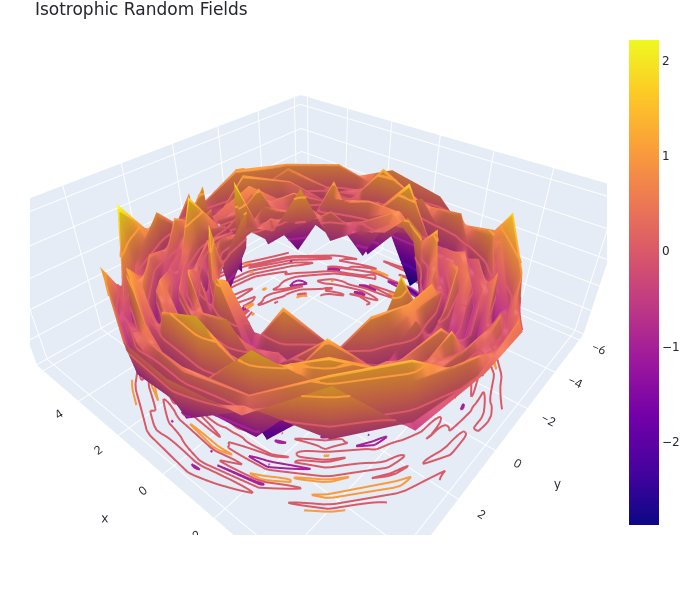

# isotropic_random_fields

This repo is meant to house the code for the paper titled `SERIES REPRESENTATIONS AND SIMULATION OF ISOTROPIC RANDOM FIELDS IN THE EUCLIDEAN SPACE`, by Chunsheng Ma and Zhengwei Ma.

### Sample Simulation Results

### File Guide

* `Example.ipynb` is a notebook that shows the code used for simulation
* An extended version of the code in the notebook is used in the `simulation.py` file, which is used to house the website version
* `Pipfile` and `Pipfile.lock` are used for replication of the results