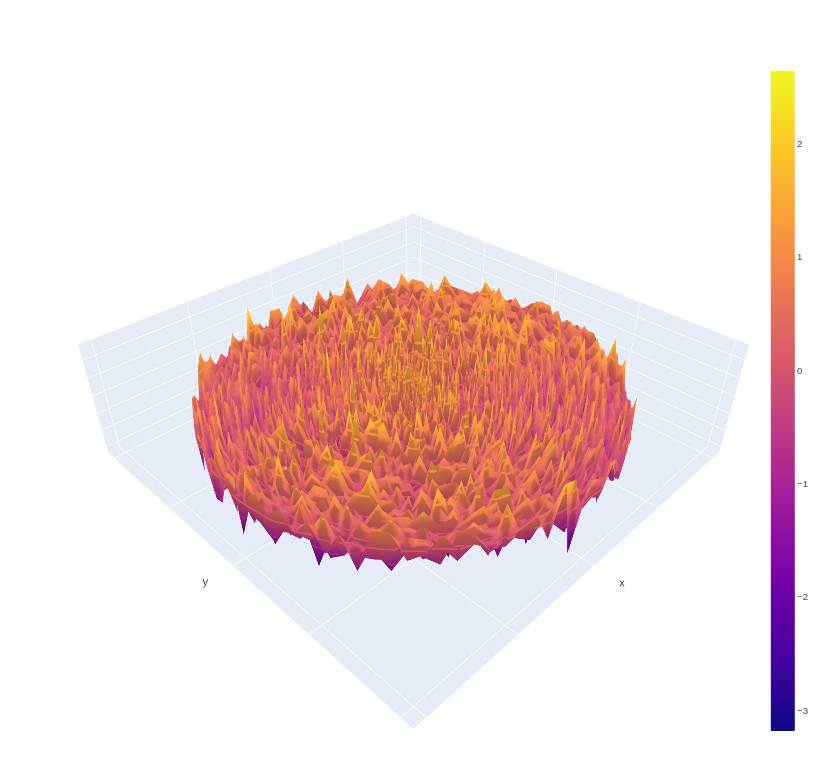

# isotropic_random_fields

This repo is meant to house the code for the paper titled `SERIES REPRESENTATIONS AND SIMULATION OF ISOTROPIC RANDOM FIELDS IN THE EUCLIDEAN SPACE`, by Chunsheng Ma and Zhengwei Ma.

### Abstract

This paper introduces the series expansion for homogeneous, isotropic and mean square
continuous random fields in the Euclidean space, which involves the Bessel function and the ultraspherical
polynomial, but differs from the spectral representation in terms of the ordinary spherical harmonics
that has more terms at each level. The series representation provides a simple and efficient approach
for simulation of isotropic (non-Gaussian) random fields.

### File Guide

* `SERIES REPRESENTATIONS AND SIMULATION OF ISOTROPIC RANDOM FIELDS IN THE EUCLIDEAN SPACE.ipynb` is a notebook that shows the code used for simulation
* A version of the code in the notebook is used in the `simulation.py` file, which is used to house the website version
* Please view [this](https://nbviewer.jupyter.org/github/wmaucla/isotropic_random_fields/blob/main/SERIES%20REPRESENTATIONS%20AND%20SIMULATION%20OF%20ISOTROPIC%20RANDOM%20FIELDS%20IN%20THE%20EUCLIDEAN%20SPACE.ipynb?flush_cache=true) link to view the notebook as a webpage
* `Pipfile` and `Pipfile.lock` are used for replication of the results

### Sample Simulation Results

Realizations of an isotropic random field on R2 in Example 3.3

### Contact
For more information, please reach us at:
* cma@math.wichita.edu
* zhengweima@gmail.com